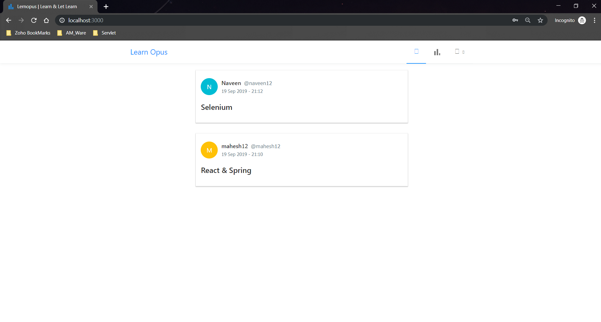

## Building a Full Stack Learn Opus app similar to Medium with Spring Boot, Spring Security, JWT, React and Ant Design



## Steps to Setup the Spring Boot Back end app (lernopus-app-server)

1. **Clone the application**

	```bash
	git clone https://github.com/callicoder/spring-security-react-ant-design-polls-app.git
	cd lernopus-app-server
	```

2. **Create MySQL database**

	```bash
	create database lernopus-dev
	```

3. **Change MySQL username and password as per your MySQL installation**

	+ open `src/main/resources/application.properties` file.

	+ change `spring.datasource.username` and `spring.datasource.password` properties as per your mysql installation

4. **Run the app**

	You can run the spring boot app by typing the following command -

	```bash
	mvn spring-boot:run
	```

	The server will start on port 1010.

	You can also package the application in the form of a `jar` file and then run it like so -

	```bash
	mvn package
	java -jar target/lernopus-0.0.1-SNAPSHOT.jar
	```
5. **Default Roles**
	
	The spring boot app uses role based authorization powered by spring security. To add the default roles in the database, I have added sql queries in `src/main/resources/` folder. These sql queries are meant for default table creation and configuration data. Spring boot will automatically execute this script on startup -

	Please Read : 
	
	1. src/main/resources/db/migration/V1_schema.sql
	2. src/main/resources/db/migration/V1_default_roles.sql
	3. src/main/resources/data.sql

## Steps to Setup the React Front end app (lernopus-app-client)

First go to the `lernopus-app-client` folder -

```bash
cd lernopus-app-client
```

Then type the following command to install the dependencies and start the application -

```bash
npm install && npm start
```

The front-end server will start on port `3000`.
